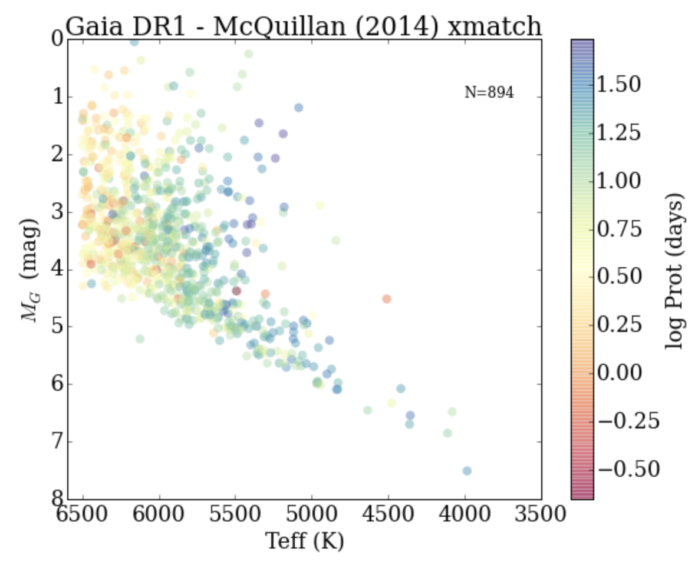

Matching rotating main sequence stars from the *Kepler* survey with astrometric data from Gaia DR1. I have found the bimodal distribution of rotation periods extends from the previously reported K/M stars all the way to F/G stars.

For more on this, see the [paper here](https://arxiv.org/abs/1610.08563)

